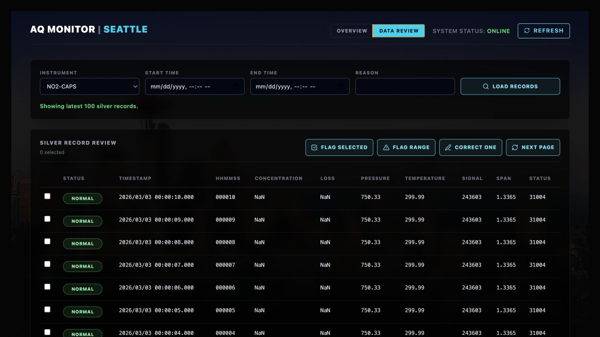

Subject: Des Moines Data Monitor update, Silver records and Review API deployed

Hi team,

Quick update on the Des Moines Data Monitor pipeline and dashboard.

The live Vercel dashboard has been redeployed with the new Data Review page:

https://project-kv69p.vercel.app

Screenshot:



What changed:

- The dashboard now has two views, Overview and Data Review.
- Overview continues to show upload status, Bronze row counts, Silver row counts, latest upload time, and month-to-date AWS cost.
- Data Review can load Silver records by instrument and time range.
- For records that look inaccurate, we can now select rows and save review flags.
- We can also save correction notes for one selected row.
- The original Bronze files are not changed. Flags and corrections are stored separately in S3 as JSON sidecar records.
- Dashboard write actions use the review API key from the dashboard URL, so there is no API key box in the UI.

Current API URLs:

- Dashboard:
  https://project-kv69p.vercel.app
- Dashboard with review write access:
  https://project-kv69p.vercel.app/?api_key=<replace-with-review-api-key>
- Dashboard metrics:
  https://yvhb48sthk.execute-api.us-west-2.amazonaws.com/metrics
- Silver record browser, read only:
  https://yvhb48sthk.execute-api.us-west-2.amazonaws.com/silver-records?instrument=NO2-CAPS&limit=5&order=desc
- Record flags, read existing flags:
  https://yvhb48sthk.execute-api.us-west-2.amazonaws.com/record-flags?instrument=NO2-CAPS
- Record flags, create a flag:
  https://yvhb48sthk.execute-api.us-west-2.amazonaws.com/record-flags?api_key=<replace-with-review-api-key>
- Record corrections, read existing corrections:
  https://yvhb48sthk.execute-api.us-west-2.amazonaws.com/record-corrections?instrument=NO2-CAPS
- Record corrections, create a correction:
  https://yvhb48sthk.execute-api.us-west-2.amazonaws.com/record-corrections?api_key=<replace-with-review-api-key>

Endpoint notes:

- `GET /metrics` returns dashboard KPIs, instrument status, Bronze row counts, Silver row counts, latest upload time, and AWS month-to-date cost.
- `GET /silver-records` returns Silver rows as JSON. Main query params are `instrument`, `start`, `end`, `limit`, `cursor`, and `order`. Use `order=desc` for latest records first.
- `POST /record-flags?api_key=...` creates a JSON flag in S3 for selected rows or a time range.
- `POST /record-corrections?api_key=...` creates a JSON correction note in S3 for one selected Silver row.
- These review writes do not rewrite Bronze or Silver data. They save separate sidecar JSON records.

Small direct API check snippet:

```python
import json
import urllib.parse
import urllib.request

API_BASE_URL = "https://yvhb48sthk.execute-api.us-west-2.amazonaws.com"
REVIEW_API_KEY = "<replace-with-review-api-key>"


def get_json(url):
    with urllib.request.urlopen(url, timeout=30) as response:
        return json.load(response)


params = urllib.parse.urlencode({
    "instrument": "NO2-CAPS",
    "limit": 5,
    "order": "desc",
})
records = get_json(f"{API_BASE_URL}/silver-records?{params}")

print("Rows returned:", len(records["rows"]))
for row in records["rows"]:
    print(row["timestamp"], row["status"], row["row_key"])


# Only run this POST block when you really want to create a review flag.
flag_payload = {
    "instrument_id": "NO2-CAPS",
    "scope": "time_range",
    "start_time": "2026-03-02T00:00:00",
    "end_time": "2026-03-02T00:05:00",
    "reason": "Example review flag for suspected inaccurate records",
}

flag_url = (
    f"{API_BASE_URL}/record-flags?"
    + urllib.parse.urlencode({"api_key": REVIEW_API_KEY})
)
request = urllib.request.Request(
    flag_url,
    data=json.dumps(flag_payload).encode("utf-8"),
    headers={"Content-Type": "application/json"},
    method="POST",
)

with urllib.request.urlopen(request, timeout=30) as response:
    print(json.load(response))
```

Review API key:

```text
<share separately through the approved private channel>
```

Current status:

- Bronze upload is already working.
- Silver records are available in AWS for all five instruments.
- The new AWS API routes are deployed and tested.
- The Vercel dashboard is redeployed and shows the Data Review page.
- A small smoke test script is available in the repo at `scripts/check_review_api.py`.

Thanks,
Pavan
